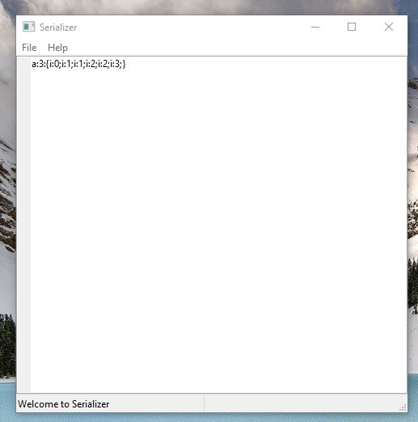
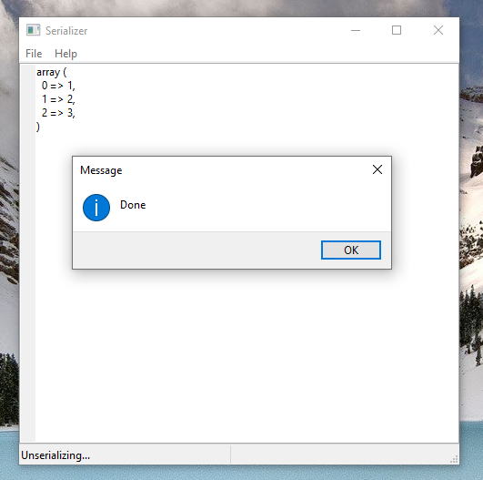
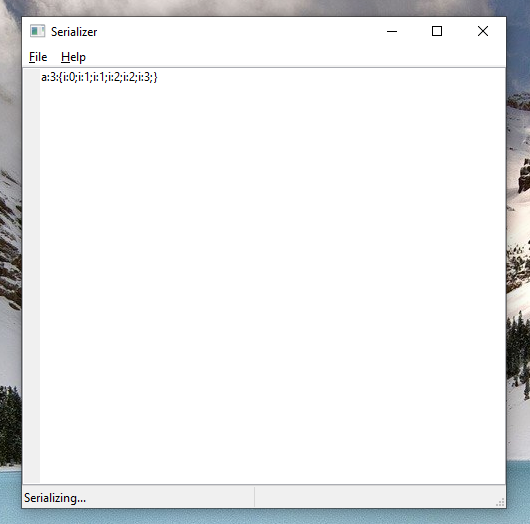
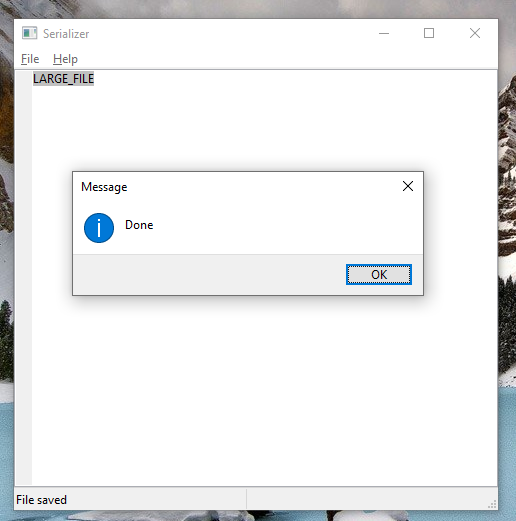

# wxphp-serializer
Serialize/Unserialize PHP text

## 1
1. File/Toggle serialize

2. File/Toggle serialize again.

3. File/Toggle serialize again.

## 2 Serialize by path to file

1. Paste path to file very large to textarea
`C:\Data\LARG_FILE`

2. File/Toggle serialize
3. Get your file `C:\Data\LARG_FILE.php`

